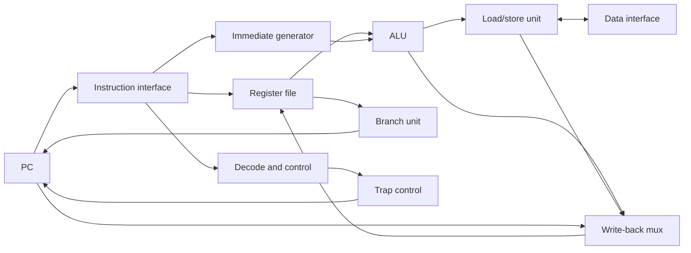
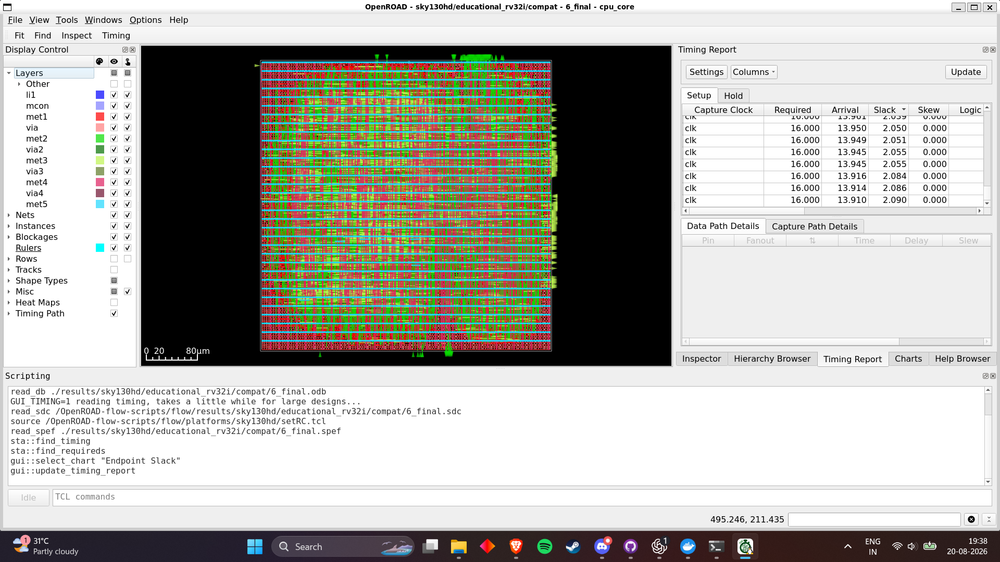
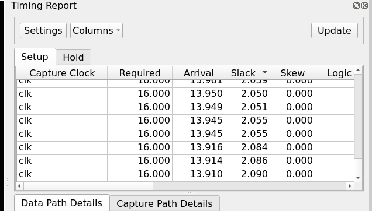
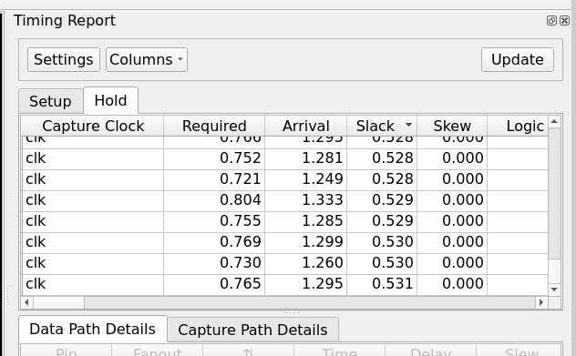
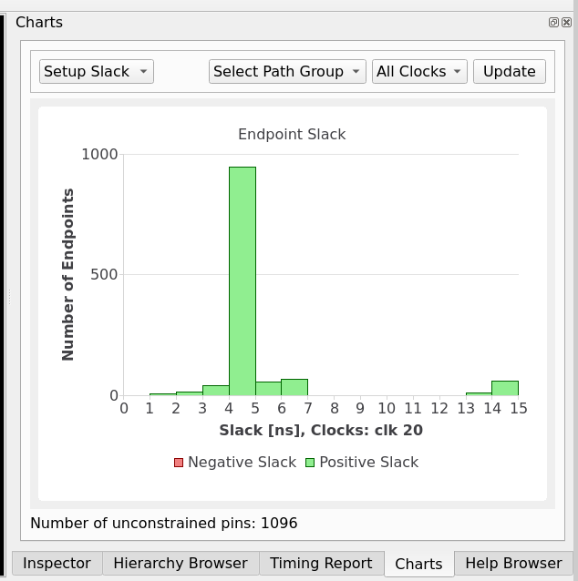

# Educational RV32I Processor Core

A readable, synthesizable, single-cycle 32-bit RISC-V core intended for RTL,
verification, and introductory ASIC-flow study. The maintained design has
external instruction/data buses; simulation memories are separate. The older
subset implementation and historical screenshots are preserved as legacy
material, not presented as current verification evidence.

## Architecture



Every instruction completes in one cycle when external reads are combinational.
There is no pipeline, cache, privilege implementation, or memory handshake.
The next PC is PC+4, branch/JAL target, or JALR target. A trap freezes the PC
and architectural state until reset.

## Instruction support

These instructions are implemented and exercised by the internal directed
regression. This is not an official architectural-compliance claim.

| Group | Instructions | Directed status |
|---|---|---|
| Register ALU | ADD, SUB, SLL, SLT, SLTU, XOR, SRL, SRA, OR, AND | Pass |
| Immediate ALU | ADDI, SLTI, SLTIU, XORI, ORI, ANDI, SLLI, SRLI, SRAI | Pass |
| Loads | LB, LH, LW, LBU, LHU | Pass |
| Stores | SB, SH, SW | Pass |
| Branches | BEQ, BNE, BLT, BGE, BLTU, BGEU | Pass |
| Upper immediate | LUI, AUIPC | Pass |
| Jumps | JAL, JALR | Pass |
| Memory order/system | FENCE, ECALL, EBREAK | Pass |
| Pseudoinstruction | NOP (`addi x0,x0,0`) | Pass |

FENCE is an architecturally safe no-operation for this in-order, cacheless
core. FENCE.I and CSR instructions are not part of this implementation.

## Datapath and modules

| File | Purpose |
|---|---|
| `rtl/cpu_core.v` | Top-level PC, write-back, bus controls, and precise traps |
| `rtl/control_unit.v` | Full opcode/funct validation and control generation |
| `rtl/alu.v` | Arithmetic, logic, shifts, signed/unsigned comparisons |
| `rtl/immediate_generator.v` | I/S/B/U/J immediate extraction |
| `rtl/register_file.v` | 32×32 two-read/one-write registers; x0 is hardwired zero |
| `rtl/branch_unit.v` | Signed and unsigned branch comparisons |
| `rtl/load_store_unit.v` | Lane selection, extension, strobes, alignment checks |
| `rtl/simulation_memory.v` | `$readmemh` instruction and byte-addressed data model |
| `rtl/cpu_sim_top.v` | Simulation-only core/memory wrapper |

Control uses a four-bit ALU operation, a three-bit immediate format, and a
two-bit write-back selection (ALU/upper result, load result, or PC+4). Decode
defaults all side effects off and invalid funct3/funct7 combinations trap.

## Core interfaces

| Signal | Direction | Meaning |
|---|---|---|
| `clk`, `rst` | input | Rising-edge clock and asynchronous active-high reset |
| `instr_addr[31:0]` | output | Byte address of current instruction |
| `instr_rdata[31:0]` | input | Combinational instruction word |
| `data_addr[31:0]` | output | Byte address; memory returns its containing aligned word |
| `data_rdata[31:0]` | input | Combinational aligned read word |
| `data_read`, `data_write` | output | Mutually exclusive access enables |
| `data_wdata[31:0]` | output | Store value replicated/positioned for byte lanes |
| `data_wstrb[3:0]` | output | One enable per byte lane |
| `trap_valid` | output | Latched exception indication; cleared by reset |
| `trap_cause[3:0]`, `trap_pc[31:0]` | output | Cause code and faulting instruction address |

The current interface has no valid/ready handshake. Slow or synchronous memory
requires a small multicycle controller before integration.

## Trap behavior

| Cause | Value | Condition |
|---|---:|---|
| Instruction address misaligned | 0 | Taken branch/JAL/JALR target not four-byte aligned |
| Illegal instruction | 2 | Unsupported opcode or invalid funct combination |
| Breakpoint | 3 | EBREAK |
| Load address misaligned | 4 | Odd LH/LHU or non-word-aligned LW |
| Store address misaligned | 6 | Odd SH or non-word-aligned SW |
| Environment call from M-mode | 11 | ECALL (educational fixed cause; no privilege state) |

The faulting instruction cannot write a register or memory. The core exposes
the trap and halts; it does not implement `mtvec`, `mepc`, other CSRs, or a trap
return instruction. Reset is the only recovery mechanism.

## Project layout

```text
rtl/                 maintained synthesizable core and simulation wrapper
tb/unit/             self-checking module tests
tb/core/             self-checking CPU-level directed regression
tb/programs/         program-image notes
software/assembly/   example RV32I assembly
software/hex/        readmemh images
scripts/             Questa and program-build scripts
openroad/            SKY130HD flow configuration and constraints
docs/                walkthrough, plan, legacy images/results
src/                 preserved legacy subset RTL
tb/*.v               preserved legacy waveform tests
```

## Build and verification

On this Windows machine, run the installed Questa/ModelSim regression directly:

```powershell
powershell -NoProfile -ExecutionPolicy Bypass -File scripts/run-questa.ps1 all
```

With GNU Make installed, the requested targets are:

```sh
make lint
make unit-test
make core-test
make isa-test
make test
make openroad-synth
make openroad-flow
make clean
```

`make lint` requires Verilator. `make test` runs unit and core suites with
Questa. For manual Questa use:

```tcl
vlib work
vlog -sv rtl/*.v tb/unit/unit_tb.sv tb/core/core_tb.sv
vsim -c unit_tb -do "run -all; quit -f"
vsim -c core_tb -do "run -all; quit -f"
```

The directed core test covers positive/negative immediates, signed/unsigned
comparisons, shifts 0/31 at unit or core level, taken/not-taken and forward/
backward branches, jump links, load extension, byte lanes/strobes, x0, invalid
encodings, instruction/data alignment, reset during execution, ECALL, and
EBREAK. Mismatches use `$fatal`; PASS is printed only after all checks.

### Latest local results (2026-08-20)

| Check | Result |
|---|---|
| Questa RTL compile | Pass, 0 errors, 0 warnings |
| Unit regression | Pass, 46 checks |
| Core directed regression | Pass, 40 checks |
| Verilator lint | Not run: tool unavailable |
| Official RISC-V architectural tests | Not integrated/run |

The GNU cross-toolchain is not installed here. After installing it, rebuild the
example using `scripts/build-programs.sh`; it defaults to
`riscv64-unknown-elf-gcc -march=rv32i -mabi=ilp32`.

## Architectural-test status

Internal directed tests and official tests are deliberately separate. No
random/generated suite is presently included. No `riscv-arch-test` or Sail
reference-model run has been performed, so this project does not claim official
RV32I compliance. `make isa-test` reports the missing integration instead of
fabricating success.

## OpenROAD

`openroad/config.mk` uses `cpu_core`, includes only synthesizable RTL, and keeps
the `sky130hd` platform. The starter constraint is 20 ns (50 MHz), 35% core
utilization, and 4 ns external I/O delays. See `openroad/README.md`.

The SKY130HD flow synthesized the core to 7,335 mapped cells and 71,083.174 µm²
with zero Yosys design-check problems. A complete compatibility run then passed
CTS and routing and produced `6_final.gds`. At the 20 ns constraint, final
extracted timing reports +1.32 ns setup WNS, +0.50 ns hold slack, and zero
setup/hold violations. Detailed routing and antenna checks both finish with zero
violations; placed design area is 81,482 µm² at 40% core utilization, estimated
power is 5.39 mW, and worst reported IR drop is 0.112 mV.

The run uses the local `openroad/orfs:v2-compatible-20260818` image with
`LEC_CHECK=0` because the available ORFS binaries otherwise execute an
unsupported AVX-512 instruction during CTS on this laptop. Consequently, the
flow's post-resize formal equivalence check was skipped and is not claimed as
passed. See `openroad/README.md` for commands, outputs, and limitations.
Historical images under `docs/openroad-results/` apply only to the old subset.

### Physical-design results

The OpenROAD GUI below shows the completed `cpu_core` database with placed
SKY130HD standard cells, power distribution, signal routing through `met1` to
`met5`, I/O pins, and extracted timing loaded from the final SPEF.



The GUI timing views show representative positive setup and hold endpoint
slacks. The histogram contains only positive setup-slack bins; authoritative
worst-case values are taken from the generated `6_finish.rpt` report.

| Setup timing | Hold timing |
|---|---|
|  |  |



## Design changes from the original

The original embedded demonstration memories were removed from the synthesis
top, decode was changed from a few one-bit controls to explicit multiway
controls, all immediate formats and RV32I ALU functions were added, byte strobes
and access-size logic were introduced, and traps became visible architectural
outputs. The simple single-cycle character was retained for readability.

See `docs/INSTRUCTION_WALKTHROUGH.md` for examples through every datapath stage
and `docs/IMPLEMENTATION_PLAN.md` for implementation status.

## Known limitations and next steps

- Add valid/ready memory transactions and stalls for realistic SRAMs/buses.
- Integrate `riscv-arch-test` with a signature region and Sail reference model.
- Add constrained-random differential testing and functional coverage.
- Add independent formal equivalence and formal x0/trap property checks.
- Consider a multicycle or pipelined implementation after preserving this core
  as the simple reference design.
