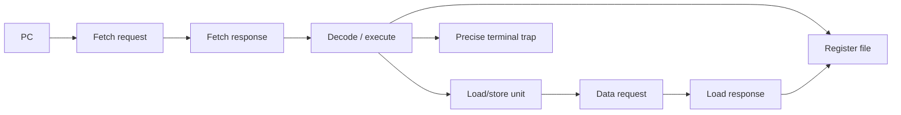
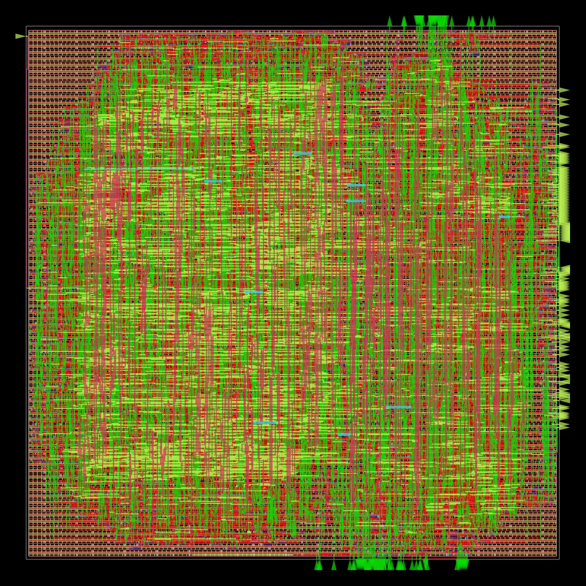

# Stallable RV32I Educational Processor

A readable, synthesizable 32-bit RISC-V processor for RTL, verification, and
introductory ASIC-flow study. The maintained `rtl/` core implements all 40 base
RV32I instructions with a stallable, non-pipelined request/response architecture.
This is an educational implementation, not a compliance or tapeout claim.

## Architecture and memory protocol



The states are `FETCH_REQ`, `FETCH_RSP`, `EXECUTE`, `DATA_REQ`, `DATA_RSP`, and
`TRAPPED`. Requests remain stable until accepted. A store completes once on its
request handshake; a load writes back only after its response. The PC and
architectural state stall while memory is unavailable. One transaction may be
outstanding, so every response belongs to the current issuing PC.

```mermaid
sequenceDiagram
  participant C as CPU
  participant M as Memory
  C->>M: req_valid + stable address/control
  Note over C: hold while req_ready=0
  M-->>C: req_ready (accepted; store completes)
  M-->>C: rsp_valid + data (fetch/load)
  Note over C: consume response and advance
```

| Interface | Signals |
|---|---|
| Instruction request | `instr_req_valid`, `instr_req_ready`, `instr_req_addr[31:0]` |
| Instruction response | `instr_rsp_valid`, `instr_rsp_data[31:0]` |
| Data request | `data_req_valid`, `data_req_ready`, `data_req_write`, `data_req_addr[31:0]`, `data_req_wdata[31:0]`, `data_req_wstrb[3:0]` |
| Data response | `data_rsp_valid`, `data_rsp_rdata[31:0]` |
| Other | `clk`, asynchronous active-high `rst`, `trap_valid`, `trap_cause[3:0]`, `trap_pc[31:0]` |

`rtl/simulation_memory.v` is excluded from synthesis and supports zero, fixed,
and deterministic pseudo-random delays plus request backpressure.

## Instruction support

Every listed instruction was checked independently through the complete core.

| Group | Instructions | Directed result |
|---|---|---:|
| Register ALU | ADD SUB SLL SLT SLTU XOR SRL SRA OR AND | PASS |
| Immediate ALU | ADDI SLTI SLTIU XORI ORI ANDI SLLI SRLI SRAI | PASS |
| Loads | LB LH LW LBU LHU | PASS |
| Stores | SB SH SW | PASS |
| Branches | BEQ BNE BLT BGE BLTU BGEU | PASS |
| Upper immediate | LUI AUIPC | PASS |
| Jumps | JAL JALR | PASS |
| Memory/system | FENCE ECALL EBREAK | PASS |

FENCE is a safe no-op for this in-order cacheless core. FENCE.I, CSRs,
privileged modes, interrupts, and trap return are absent. Traps are precise and
terminal until reset: instruction misalignment (0), illegal instruction (2),
breakpoint (3), load misalignment (4), store misalignment (6), and ECALL (11).

## Verification

```powershell
powershell -NoProfile -ExecutionPolicy Bypass -File scripts\run-questa.ps1 all
powershell -NoProfile -ExecutionPolicy Bypass -File scripts\run-formal.ps1
powershell -NoProfile -ExecutionPolicy Bypass -File scripts\run-act4.ps1
```

Make targets include `lint`, `unit-test`, `core-test`, `memory-wait-test`,
`generated-test`, `isa-test`, `test`, `formal`, `equivalence`,
`openroad-synth`, and `openroad-flow`.

| Stage | Result on 2026-08-20 |
|---|---|
| Questa compile | PASS — 0 errors, 0 warnings |
| Unit regression | PASS — 46 checks |
| Directed full-core regression | PASS — 176 checks, 63 scenarios |
| Zero/fixed/random-wait regression | PASS — all modes; one store each |
| Generated differential test | PASS — 300 instructions, seed `52a1c0de` |
| Formal safety properties | PASS — 8 assertions proved with SBY/ABC PDR |
| Verilator lint | NOT RUN — executable unavailable |
| Official ACT4 tests | NOT RUN — toolchain, Sail, and Ruby Bundle unavailable |
| RTL-to-synthesis equivalence | FAIL / not established — 1,208 unproven cells |

These forms of evidence are not substitutes for one another. The ACT4 setup is
pinned and reproducible, but official tests have not run; this project therefore
does not claim official RV32I compliance. See `reports/` and
`verification/act4/README.md`.

## SKY130 physical implementation

The revised `handshake` RTL completed the educational OpenROAD SKY130HD flow at
a 20 ns clock constraint.

| Metric | Latest result |
|---|---:|
| Yosys design check | PASS — 0 problems |
| Synthesized cells / mapped area | 8,558 / 72,087.888 µm² |
| Sequential cells | 1,175 |
| Die / placed utilization | 457.835 µm square / 40% |
| Final placed area | 82,565 µm² |
| Setup / hold slack | +9.08 ns / +0.47 ns |
| Setup / hold violations | 0 / 0 |
| Detailed-route violations | 0 |
| Antenna net / pin violations | 0 / 0 |
| Max slew / capacitance violations | 13 / 5 |
| Estimated total power | 10.7 mW |
| Minimum period / Fmax | 10.92 ns / 91.61 MHz |




### OpenROAD GUI evidence

These screenshots were captured from the current
`sky130hd/educational_rv32i/handshake/6_final` database with its final SDC and
SPEF loaded—not from the earlier compatibility revision.


The displayed hold endpoints have positive slack around 0.513–0.514 ns. The
generated text report remains authoritative and gives the worst hold slack as
+0.47 ns.


The setup-slack histogram contains only positive displayed bins. It also shows
1,193 unconstrained pins; these are primarily non-clocked external interface
ports governed by boundary delays rather than sequential endpoints. The chart
is supporting visualization, not a replacement for reviewing the SDC and
`6_finish.rpt`.


Final artifacts are in
`build/openroad/results/sky130hd/educational_rv32i/handshake/6_final.{odb,def,v,sdc,spef,gds}`.

```powershell
powershell -NoProfile -ExecutionPolicy Bypass -File scripts\run-openroad-docker.ps1 flow
powershell -NoProfile -ExecutionPolicy Bypass -File scripts\open-openroad-gui.ps1
```

ORFS LEC remains disabled because its incompatible binary crashes on this host;
the independent Yosys equivalence attempt did not prove. This is educational
P&R, not foundry signoff. Foundry DRC/LVS, production antenna signoff,
multi-corner STA, power integrity, packaging, ESD, and manufacturing checks are
outside this repository.

## Repository layout

```text
rtl/                 maintained synthesis RTL and simulation support
tb/unit/, tb/core/   maintained self-checking tests
formal/              properties and equivalence attempt
verification/act4/   pinned official-test integration scaffolding
openroad/            SKY130HD configuration and constraints
reports/             concise reproducible result records
docs/                current documentation and current layout images
legacy/rtl/          original subset RTL
legacy/tb/           original tests and empty main_tb placeholder
legacy/docs/         historical diagrams and pre-handshake layout images
```

See `docs/IMPLEMENTATION_PLAN.md` and `reports/COMPLETION_REPORT.md`.
