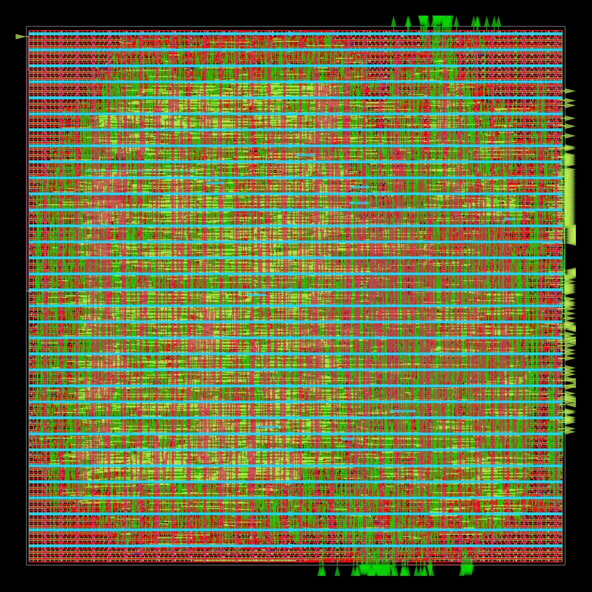
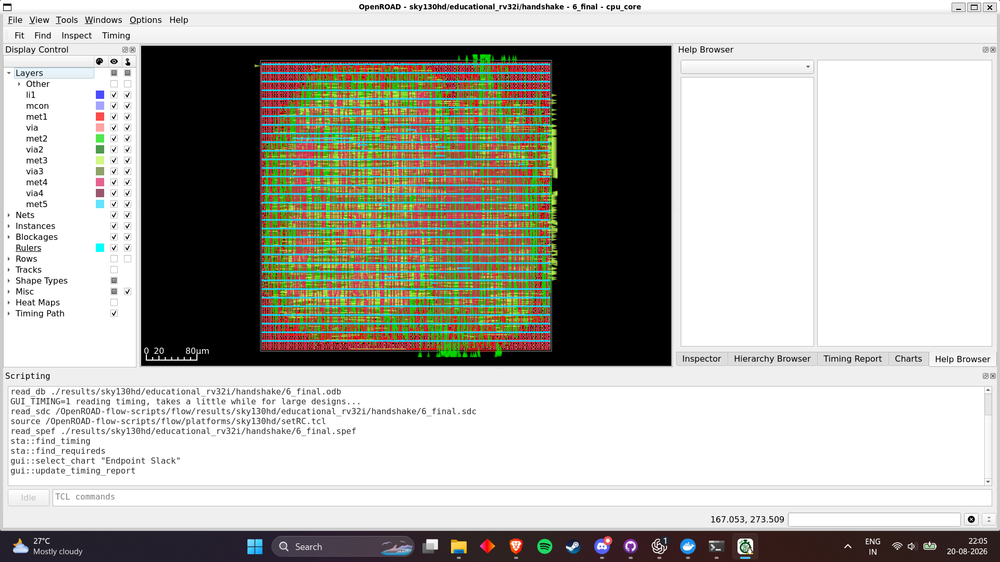
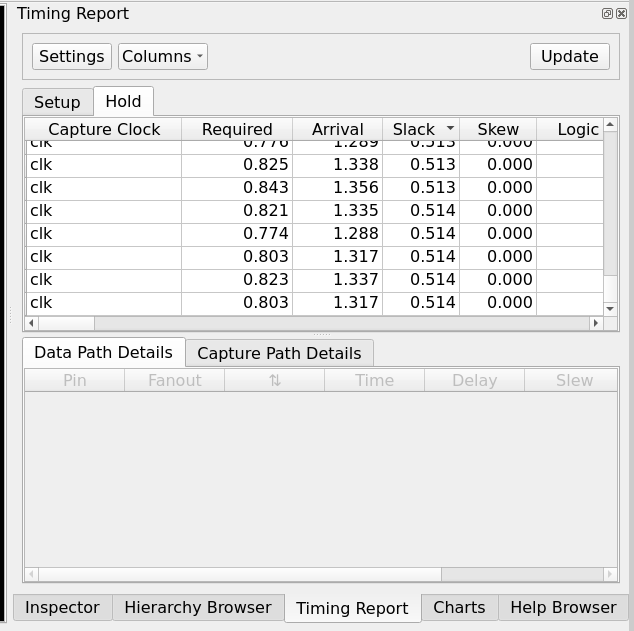
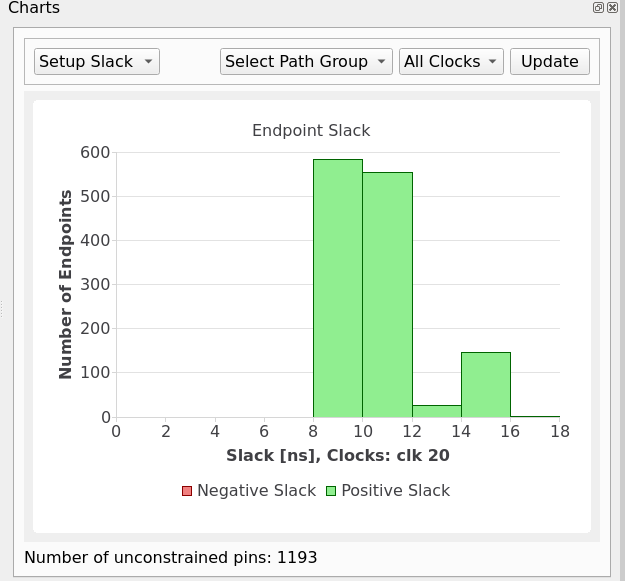

# OpenROAD SKY130HD flow

`cpu_core` is the synthesis top. Only maintained synthesizable files are used;
simulation support, tests, and `legacy/` are excluded. Constraints use a 20 ns
clock, 35% initial utilization, explicit min/max handshake I/O delays, and a
false path for asynchronous reset. Reset deassertion must be synchronized by
the integrating system.

```powershell
powershell -NoProfile -ExecutionPolicy Bypass -File scripts\run-questa.ps1 all
powershell -NoProfile -ExecutionPolicy Bypass -File scripts\run-openroad-docker.ps1 synth
powershell -NoProfile -ExecutionPolicy Bypass -File scripts\run-openroad-docker.ps1 flow
powershell -NoProfile -ExecutionPolicy Bypass -File scripts\open-openroad-gui.ps1
```

The current variant is `handshake`; outputs are under
`build/openroad/{logs,reports,results}/sky130hd/educational_rv32i/handshake/`.

| Metric | Latest result (2026-08-20) |
|---|---:|
| Yosys check | PASS, 0 problems |
| Synthesized cells / area | 8,558 / 72,087.888 µm² |
| Sequential cells | 1,175 |
| Final area / utilization | 82,565 µm² / 40% |
| Setup / hold slack | +9.08 ns / +0.47 ns |
| Setup / hold violations | 0 / 0 |
| Route / antenna-net / antenna-pin violations | 0 / 0 / 0 |
| Max slew / capacitance violations | 13 / 5 |
| Estimated total power | 10.7 mW |
| Minimum period / Fmax | 10.92 ns / 91.61 MHz |



## Current GUI screenshots

The complete GUI view below identifies the loaded database as the current
`handshake/6_final` revision and shows its routed standard-cell layout.



| Hold timing endpoints | Setup-slack distribution |
|---|---|
|  |  |

The hold screenshot displays positive endpoint values around 0.513–0.514 ns;
the authoritative worst hold slack in `6_finish.rpt` is +0.47 ns. The histogram
shows 1,193 unconstrained pins and must not be interpreted as proof that every
top-level path is constrained. Final numeric claims in this document come from
the generated report, not from cropped GUI views.

ORFS uses the compatible local image and `LEC_CHECK=0` because another local
binary crashes on this non-AVX-512 host. ORFS equivalence is skipped, not passed;
an independent Yosys attempt also failed to establish equivalence. No current
IR-drop result is claimed. Historical screenshots are under `legacy/docs/`.
This is educational P&R, not foundry signoff or tapeout readiness.
